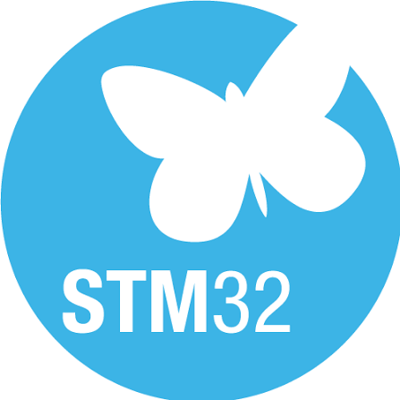

<div align="center">

# `BARBAROR4`

### Embedded Systems • Firmware • Reverse Engineering • Android • Audio DSP


</div>

---

```text
╔══════════════════════════════════════════════════════╗
║                    BARBAROR4                         ║
║                                                      ║
║   Hardware  /  Firmware  /  Android  /  Audio DSP   ║
║                                                      ║
║   "Elimde ne varsa onunla maksimumu çıkarmak."       ║
╚══════════════════════════════════════════════════════╝
```

```console
barbaror4@github:~$ whoami

Elektronik, gömülü sistemler, firmware,
Android/Linux modlama ve reverse engineering
ile ilgilenen birisi.

barbaror4@github:~$ philosophy

> Bir cihaz çalışıyorsa nasıl çalıştığını öğren.
> Çalışmıyorsa neden çalışmadığını öğren.
> Zaten iyi çalışıyorsa daha ne yaptırabileceğine bak.
```

---

# `./about_me`

Bir cihazı yalnızca **kullanmak** pek ilgimi çekmiyor.

Daha çok:

```text
İçinde hangi SoC var?
Firmware nasıl çalışıyor?
Hangi protokolü kullanıyor?
Neden bu davranışı gösteriyor?
Datasheet'in söylemediği ne var?
Üreticinin koyduğu sınır nerede?
Bu donanımdan daha ne çıkarılabilir?
```

sorularının peşinden gitmeyi seviyorum.

Özellikle düşük maliyetli, eski veya az dokümante edilmiş donanımlar ilgimi çekiyor.

Çünkü bazen birkaç dolarlık bir cihazın içinde beklenmedik derecede yetenekli bir SoC, DSP, codec veya yeniden kullanılabilecek başka donanımlar çıkabiliyor.

---

# `./hardware`

<p align="center">
  
  &nbsp;&nbsp;&nbsp;&nbsp;
  
  &nbsp;&nbsp;&nbsp;&nbsp;
  
  &nbsp;&nbsp;&nbsp;&nbsp;
  
</p>

<div align="center">


</div>

Başlıca ilgilendiğim platformlar:

```text
STM32
├── STM32F103
├── STM32F411
└── STM32F746

Espressif
├── ESP32
└── ESP8266

Audio / Consumer SoCs
├── JieLi
├── NationalChip
└── Generalplus
```

---

# `./stm32`

STM32 tarafında basit örneklerden çok, MCU'yu gerçek bir ürün gibi kullanmayı gerektiren projeleri seviyorum.

İlgilendiğim konulardan bazıları:

```text
DMA
USB
USB Audio
USB Mass Storage
SDIO
SPI
I²C
UART
I²S
Ethernet
External Flash
Audio DSP
FFT
Touchscreen UI
Audio Playback
Real-time processing
```

Bir STM32'nin sadece:

```c
HAL_GPIO_TogglePin(...);
```

yapmasından ziyade:

```text
SD karttan dosya okuması,
MP3 decode etmesi,
DSP uygulaması,
USB Audio endpoint'i olması,
Ethernet'ten radyo stream etmesi,
ekranda FFT göstermesi
```

çok daha eğlenceli.

---

# `./audio`

<div align="center">


</div>

Embedded audio özellikle en çok ilgilendiğim alanlardan biri.

```text
MP3
WAV
FLAC

USB Audio
I²S
PWM Audio
Bluetooth Audio

FFT
Spectrum Analysis
Parametric EQ
Hardware EQ
Pitch Processing
Speed Processing

Stereo Recording
Internet Radio
Audio Codecs
DACs
```

Amacım genellikle:

> **"Bir ses dosyasını nasıl çalarım?"**

değil.

Daha çok:

> **"Bu MCU'yu tam özellikli bir medya sistemine ne kadar yaklaştırabilirim?"**

---

# `./projects`

## `STM32F746G-DISCO Media Player`

STM32F746 + WM8994 tabanlı medya oynatıcı projesi.

```text
[+] SD Card
[+] exFAT
[+] USB Mass Storage

[+] USB Audio
[+] PC Mode

[+] Ethernet Internet Radio
[+] MP3
[+] WAV
[+] HE-AAC

[+] AUX Input
[+] Stereo Recording

[+] Parametric EQ
[+] WM8994 Hardware EQ

[+] FFT Visualizers
[+] Pitch Control
[+] Speed Control

[+] Touchscreen UI
```

Amaç:

```text
"STM32F746'yı daha ne kadar zorlayabiliriz?"
```

---

## `STM32F411 Audio Player`

Daha sınırlı kaynaklarla ses oynatma ve DSP denemeleri.

```text
MCU        : STM32F411
Storage    : SDIO + SPI Flash
Audio      : MP3 / WAV
Output     : Stereo PWM
Display    : ST7789
DSP        : FFT
Experiments: USB Audio
```

Kısıtlı bir MCU üzerinde çalışan bir özellik bazen çok daha güçlü bir platformda aynı özelliği yapmaktan daha tatmin edici.

---

# `./jieli`

JieLi SoC'leri özellikle ilgimi çekiyor.

```text
AC69xx
Bluetooth Audio
USB Audio
Codec Support
Firmware SDKs
BR Platforms
Chip Identification
Firmware Analysis
```

Ucuz bir Bluetooth hoparlör, kulaklık veya USB-C ses cihazını açıp içinde beklenmedik şekilde güçlü bir JieLi SoC görmek benim için gayet iyi bir gün demek.

---

# `./obscure_soc_archaeology`

```console
barbaror4@bench:~$ scan-device

Device        : unknown
Chip marking  : barely readable
Documentation : almost nonexistent
SDK           : random archive from 2018
Language      : Chinese
Password      : probably 1111

STATUS: interesting
```

NationalChip, Generalplus, JieLi ve benzeri tüketici elektroniği SoC'lerinde:

* firmware yapıları
* boot süreçleri
* SDK'lar
* undocumented özellikler
* codec desteği
* çevre birimleri
* cihaz tanımlama

gibi konuları araştırmayı seviyorum.

Dokümantasyon azaldıkça bazen ilgim artıyor.

---

# `./android`

<div align="center">


</div>

Android tarafında özellikle Samsung / Exynos cihazlarıyla ilgileniyorum.

```text
Root
Custom Kernels
Kernel Tuning
Overclocking
Recovery
Firmware
ADB
Linux
Android Internals
System Modification
Hardware Modding
```

Telefonu sadece telefon olarak değil:

```text
ARM Linux machine
+
display
+
battery
+
USB
+
Wi-Fi
+
Bluetooth
+
sensors
+
a ridiculous amount of undocumented hardware
```

olarak görmek daha eğlenceli.

---

# `./budget_engineering`

```console
barbaror4@bench:~$ ls equipment/

multimeter
ch341a
usb-uart
random-wires
old-hardware
datasheets
software-tools
questionable-chinese-sdks
```

```console
barbaror4@bench:~$ ls expensive_lab_equipment/

ls: cannot access 'expensive_lab_equipment/': No such file or directory
```

😅

Osiloskop, logic analyzer veya pahalı profesyonel debug ekipmanlarım yok.

Bu yüzden mümkün olduğunca elimdekileri kullanıyorum:

```text
UART logs
USB descriptors
ADB
Kernel logs
Software diagnostics
Multimeter
Datasheets
SDK source code
Firmware dumps
CH341A
Trial & error
```

Benim için güzel tarafı da burada.

Bir probleme:

```text
"Hangi pahalı ekipmanı satın almalıyım?"
```

yerine:

```text
"Elimdeki şeylerle bunu nasıl anlayabilirim?"
```

diye yaklaşmayı seviyorum.

---

## `engineering_philosophy.txt`

```text
Expensive != Interesting
New       != Better
Old       != Useless
Cheap     != Simple

Limited hardware + creativity > buying the solution
```

---

# `./tools`

<div align="center">


</div>

```yaml
languages:
  - C
  - C++
  - Python

embedded:
  - STM32CubeIDE
  - STM32 HAL
  - ESP32
  - ESP8266

debugging:
  - UART
  - ADB
  - Linux logs
  - USB descriptors
  - Multimeter
  - CH341A

other:
  - Git
  - GitHub
  - Linux
  - Datasheets
  - SDK archaeology
```

---

# `./currently_interested_in`

```text
[0x01] Embedded Audio
[0x02] STM32
[0x03] JieLi SoCs
[0x04] Firmware Reverse Engineering
[0x05] Android Kernels
[0x06] Samsung / Exynos
[0x07] USB Internals
[0x08] Audio DSP
[0x09] Obscure SoCs
[0x0A] Old Hardware
[0x0B] Reusing Cheap Electronics
[0x0C] Finding out what happens if I do this...
```

---

# `./stats`

<div align="center">


<br>


</div>

---

# `./contributions`

<div align="center">


</div>

---

# `main.c`

```c
#include <stdint.h>

int main(void)
{
    while (1)
    {
        if (device_is_unknown())
        {
            identify_chip();
            dump_firmware();
            find_sdk();
            read_datasheet();
        }

        if (device_works())
        {
            understand_it();
            modify_it();
            push_it_further();
        }
        else
        {
            debug_until_it_does();
        }
    }
}
```

---

<div align="center">

### `Hardware is more fun when you're not supposed to touch it.`

`STM32 • JieLi • Firmware • Android • DSP • Reverse Engineering`

</div>
